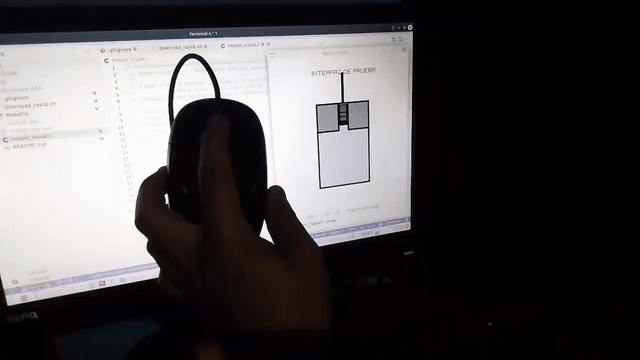

# Mouse Visual

Este proyecto dibuja un mouse estilo pixel art usando Raylib.

## Estructura del proyecto

- `mouse_visual.c` - Código principal final, con constantes definidas en orden alfabético.
- `Makefile` - Instrucciones para compilar en Linux y generar un ejecutable Windows si la herramienta cruzada está disponible.
- `include/` - Cabeceras de Raylib.
- `lib/` - Biblioteca estática de Raylib para Linux.
- `lib_mingw-w64/` - Biblioteca Raylib para compilación Windows.
- `test.gif` - GIF de demostración optimizado del proyecto.

## Demo en GIF

El siguiente GIF muestra el proyecto en ejecución:



## Cómo compilar

### Preparar raylib

Si no tienes las bibliotecas de raylib en `lib/` y `lib_mingw-w64/`, ejecuta:

```sh
./download_raylib.sh
```

El script descarga raylib, compila la versión Linux y, si está disponible, también compila la versión Windows usando MinGW.

### Linux

Ejecuta:

```sh
make
```

Esto produce el ejecutable `mouse_app`.

### Windows (cross compile)

Ejecuta:

```sh
make windows
```

Esto produce el ejecutable `mouse_app.exe`, siempre que tengas instalado el compilador cruzado `x86_64-w64-mingw32-gcc`.

La compilación Windows usa flags específicos de MinGW y no hereda las librerías/X11 de Linux.

## Comandos equivalentes

### Linux directo

```sh
gcc mouse_visual.c -o mouse_app -I./include ./lib/libraylib.a -static-libgcc -static-libstdc++ -lX11 -lXi -lGL -lm -lpthread -ldl -lrt
```

### Windows directo

```sh
x86_64-w64-mingw32-gcc mouse_visual.c -o mouse_app.exe -I./include -L./lib_mingw-w64 -lraylib -lopengl32 -lgdi32 -lwinmm -static
```

## Notas

- Todas las constantes están definidas con `#define` en orden alfabético.
- Las llamadas a Raylib usan variables intermedias antes de pasar valores a las funciones.
